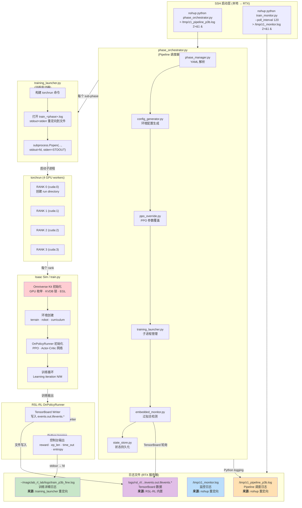
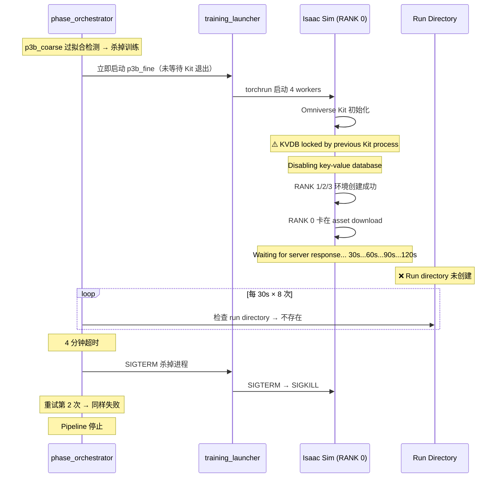

# Z1 Training Logging Architecture

## 日志来源总览

训练系统共产生 **4 类日志**，分别由不同层级的组件生成：

| 日志文件 | 位置 | 生成者 | 内容 |
|----------|------|--------|------|
| `train_<phase>.log` | `~/magiclab_rl_lab/logs/` | `training_launcher.py` | Isaac Sim 全部输出（GPU 初始化、env 创建、训练迭代） |
| `z1_pipeline_*.log` | `/tmp/` | `phase_orchestrator.py` | Pipeline 调度日志（phase 切换、超时、重试、错误） |
| `z1_monitor.log` | `/tmp/` | `train_monitor.py` | 过拟合检测、best model 识别 |
| `events.out.tfevents.*` | `logs/rsl_rl/.../<run_dir>/` | RSL-RL `OnPolicyRunner` | TensorBoard 指标数据 |

## 日志流程图



## 各日志详解

### 1. Pipeline 日志 — `train_<phase>.log`

**生成方式：** `training_launcher.py` 用 `subprocess.Popen` 启动 torchrun，将 stdout/stderr 重定向到文件。

```
training_launcher.py 第 58-81 行:
  log_file = self._log_dir / f"train_{run_name}.log"
  fd = open(log_file, "w")
  proc = subprocess.Popen(cmd, stdout=fd, stderr=subprocess.STDOUT)
```

**内容：** Isaac Sim 完整启动日志，包括：
- GPU 枚举与 Vulkan 信息
- Omniverse Kit 加载、KVDB 锁状态
- 环境创建（terrain、robot、curriculum）
- Actor/Critic 网络结构
- RSL-RL 训练迭代（`Learning iteration N/M`）

### 2. Orchestrator 日志 — `z1_pipeline_*.log`

**生成方式：** 本地 SSH 启动 orchestrator 时通过 nohup 重定向。

```bash
ssh ... "nohup python phase_orchestrator.py ... > /tmp/z1_pipeline_p3b.log 2>&1 &"
```

**内容：** Pipeline 调度层面的事件：
- Sub-phase 启动/停止
- Run directory 查找（每 30s 轮询，最多 8 次）
- 过拟合检测结果
- 重试与回滚决策
- 错误与终止原因

### 3. Monitor 日志 — `z1_monitor.log`

**生成方式：** 同样通过 nohup 重定向。

```bash
ssh ... "nohup python train_monitor.py ... > /tmp/z1_monitor.log 2>&1 &"
```

**内容：** 所有 run 的定期扫描结果：
- 每 120s 扫描所有 run 目录
- 读取最新 checkpoint 的 TensorBoard 数据
- 过拟合检测（reward 下降、entropy 坍缩等）
- 最佳 checkpoint 标记

### 4. TensorBoard 数据 — `events.out.tfevents.*`

**生成方式：** RSL-RL 库内置的 TensorBoard writer，由 `OnPolicyRunner` 自动创建。

**内容：** 结构化的训练指标：
- Episode Reward（各项细分）
- Episode Termination（time_out、bad_orientation）
- Curriculum（terrain_levels、vel_levels）
- Loss（entropy、value_loss）

## p3b_fine 失败案例复盘



**根因：** Orchestrator 在杀掉 p3b_coarse 训练后**未等待 Kit 进程完全退出**就立即启动 p3b_fine，导致 KVDB 锁冲突。
