# Z1 5-Phase Orchestrator 运维指南

> Phase-Based Training Orchestrator 的完整技术文档，涵盖架构、流程、状态管理、CLI 用法和故障恢复。

## 1. 架构总览

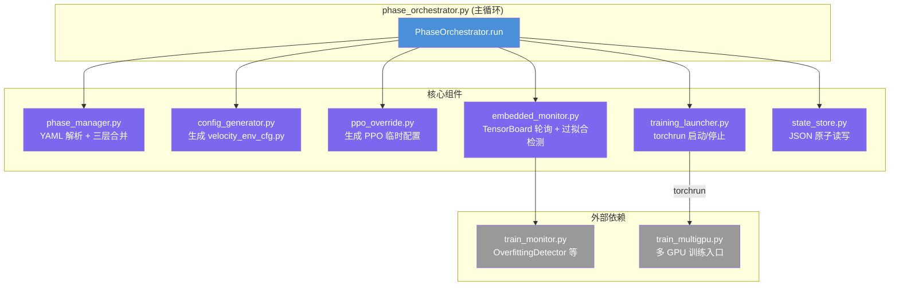

## 2. 两层循环：主事件循环

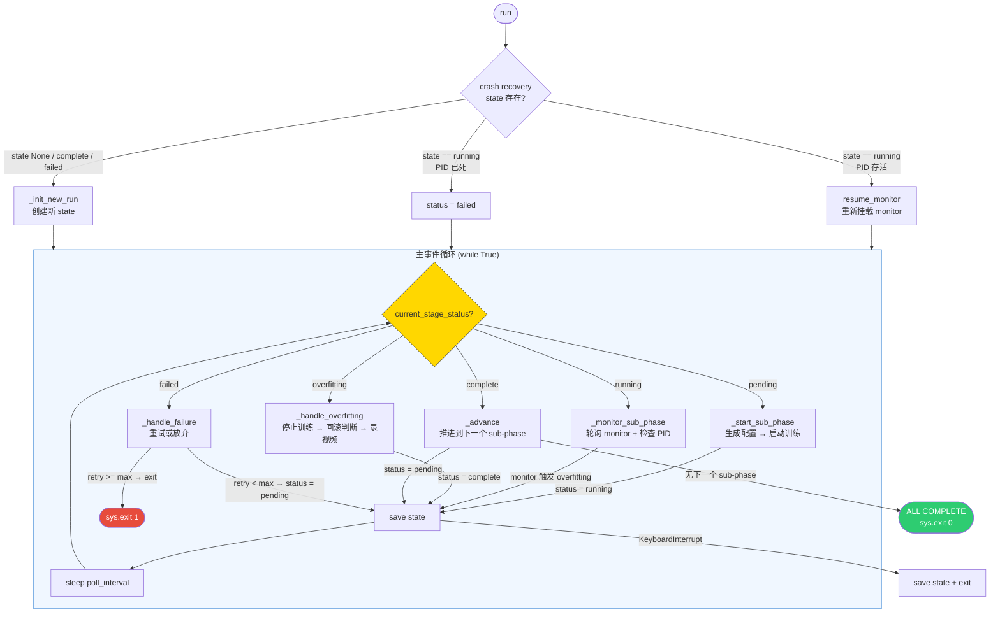

## 3. Sub-Phase 执行流程 (pending → running)

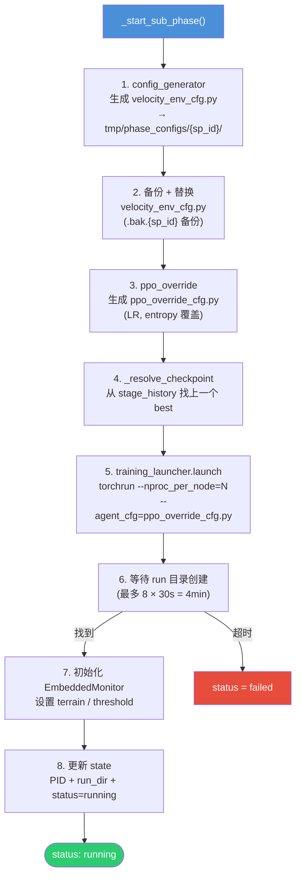

## 4. 监控循环 (running → overfitting)

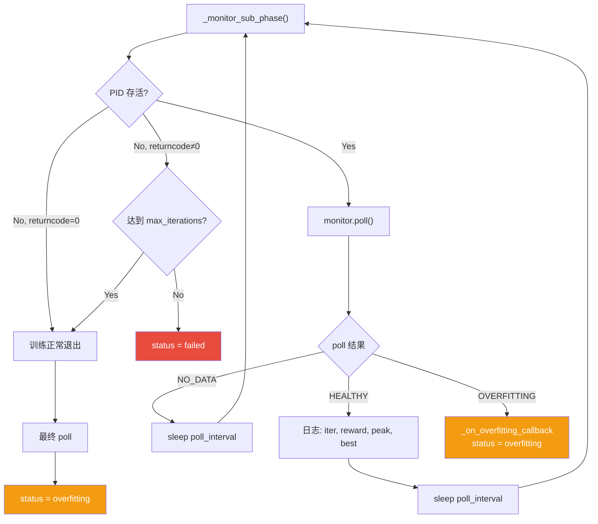

## 5. 过拟合处理 + 回滚 (overfitting → complete)

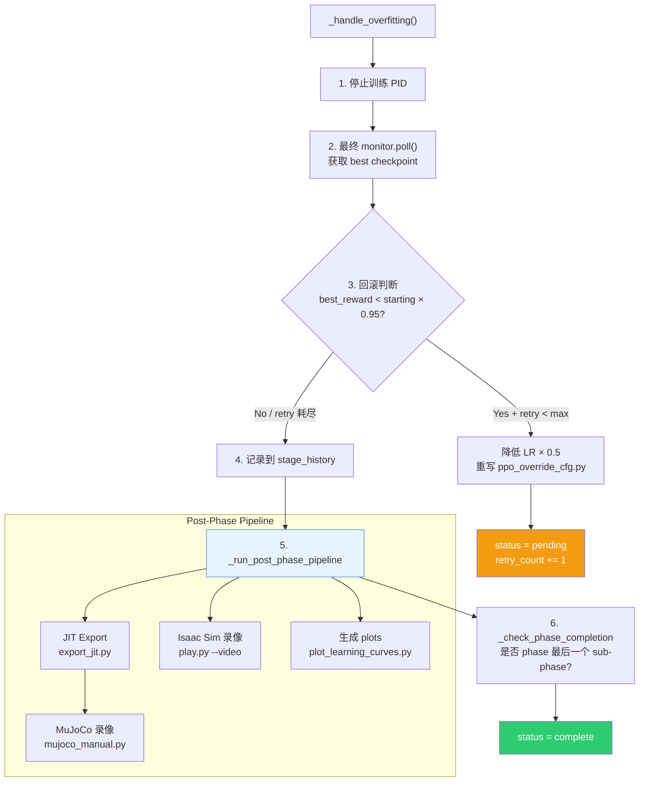

## 6. 推进逻辑 (complete → next pending)

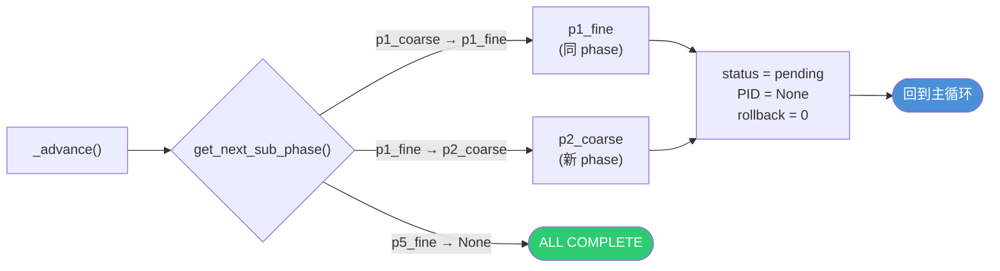

## 7. 状态管理 (orchestrator_state.json)

### 7.1 State 数据结构

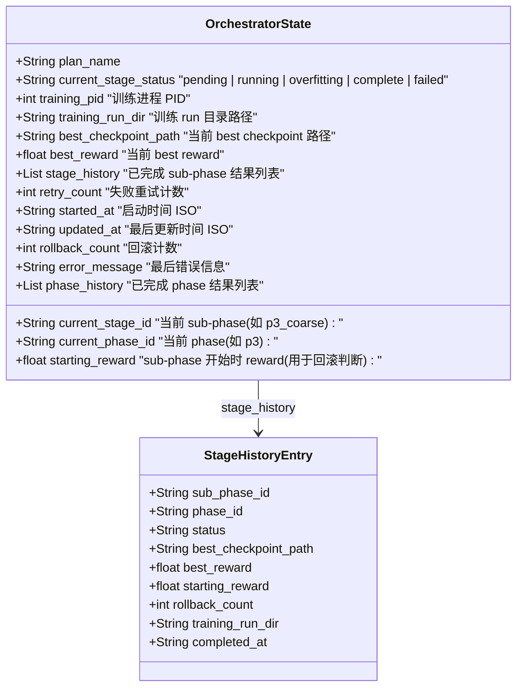

### 7.2 State 写入时机

| 时机 | 写入内容 |
|------|----------|
| `_init_new_run` | plan_name, start_id, status=pending |
| `_start_sub_phase` | PID, run_dir, status=running, phase_id |
| `_handle_overfitting` | stage_history 追加, best_checkpoint, best_reward |
| `_advance` | current_stage_id=next, status=pending |
| `_handle_failure` | retry_count++ |
| `KeyboardInterrupt` | 保存当前 state |
| 主循环每轮结束 | save (原子写入) |

### 7.3 原子写入

StateStore 使用 write-to-tmp + os.replace 模式，确保断电不会损坏文件。

## 8. CLI 参数与模式

### 8.1 启动模式决策树

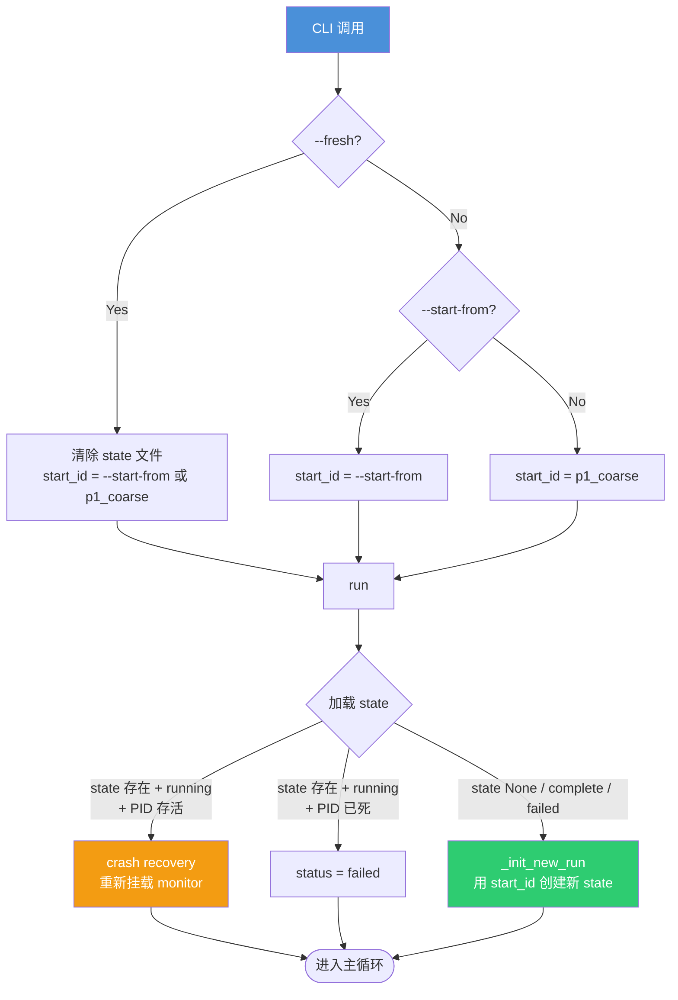

### 8.2 模式对比

| 模式 | CLI | 行为 | 使用场景 |
|------|-----|------|----------|
| **Fresh** | `--fresh` | 删除 state，从 p1_coarse 开始 | 全新训练、彻底重开 |
| **Fresh + Start From** | `--fresh --start-from p3_coarse` | 删除 state，从指定 sub-phase 开始（无前序 checkpoint 信息） | 跳过已完成阶段，但需要手动提供 checkpoint |
| **Start From** | `--start-from p3_coarse` | 保留 state，从指定 sub-phase 开始 | 跳到特定阶段 |
| **Resume** | (无特殊参数) | 加载 state，继续当前进度 | orchestrator 崩溃后恢复 |
| **Dry Run** | `--dry-run` | 打印所有 10 个 sub-phase 参数，不执行 | 参数检查 |
| **Smoke Test** | `--smoke-test` | 每个 sub-phase 只跑 50 iter 验证管线 | 管线完整性验证 |

> **注意**: `--fresh --start-from` 会导致 `_resolve_checkpoint()` 返回 None（因为 state 被清空、stage_history 为空），训练将从随机初始化开始。必须手动指定 `--load_run` 和 `--checkpoint`，或先让前序 phase 完成以积累 stage_history。

### 8.3 完整 CLI 参数

```
--plan           训练计划 YAML 路径 (required)
--project-root   项目根目录 (default: .)
--log-root       TensorBoard 日志根目录 (default: logs/rsl_rl/...)
--start-from     起始 sub-phase ID
--fresh          忽略已保存状态
--dry-run        打印配置不执行
--smoke-test     每个 sub-phase 最小化验证
--poll-interval  监控轮询间隔秒数 (default: 120)
--state-file     state 文件名 (default: orchestrator_state.json)
--num-gpus       GPU 数量 (default: 4)
```

## 9. EmbeddedMonitor 内部流程

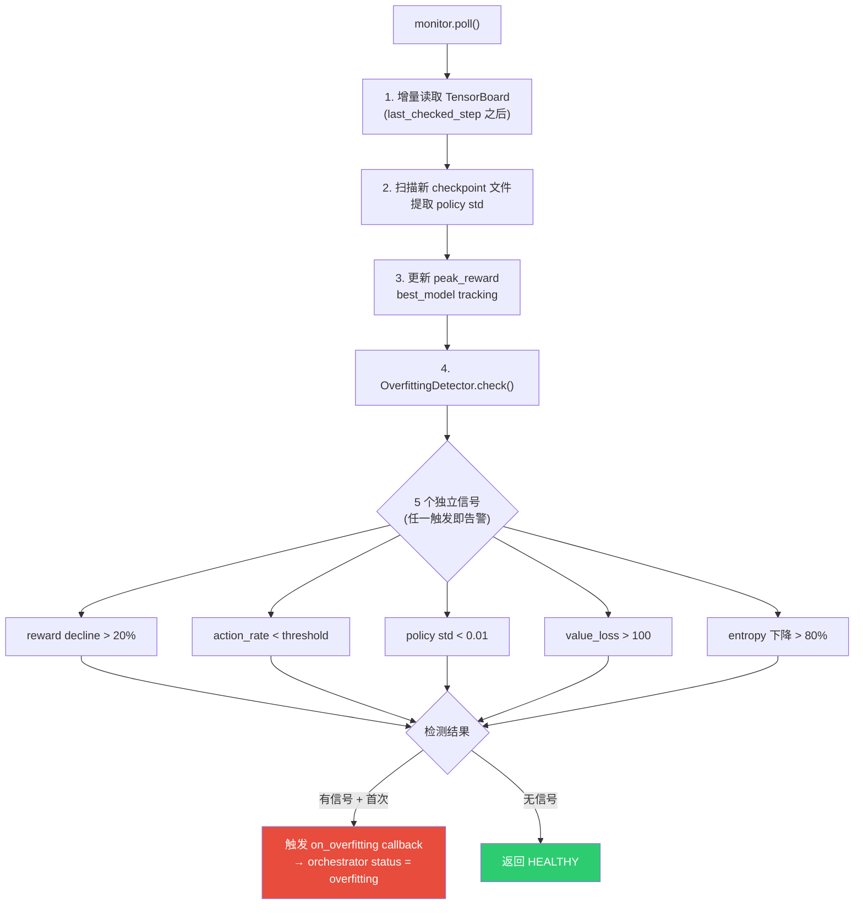

## 10. 自动回滚机制

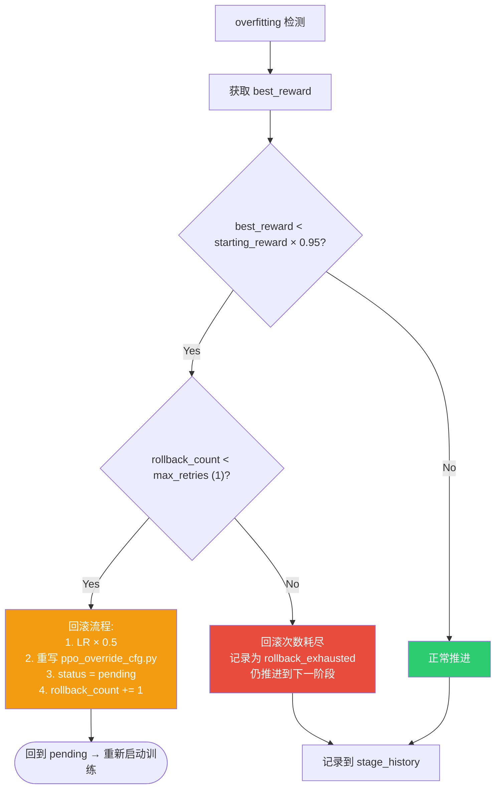

## 11. 故障恢复与运维

### 11.1 常见故障场景

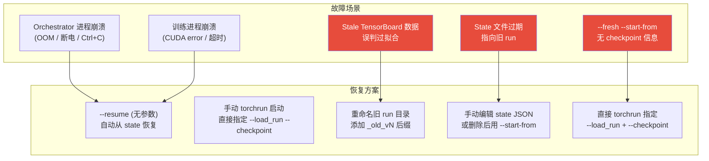

### 11.2 恢复操作手册

#### 场景 A: Orchestrator 崩溃，训练仍在运行

```bash
# 1. 确认训练进程存活
ssh phh@192.168.120.155 'ps aux | grep train_multigpu | grep phh | grep -v grep'

# 2. 直接 resume orchestrator（会自动挂载到运行中的训练）
ssh phh@192.168.120.155 "cd ~/magiclab_rl_lab && nohup python -u scripts/automation/phase_orchestrator.py \
    --plan training_plans/z1_5phase_plan.yaml --num-gpus 4 --poll-interval 120 \
    > /tmp/z1_5phase_pipeline.log 2>&1 & echo PID=\$!"
```

#### 场景 B: Orchestrator + 训练都崩溃

```bash
# 1. 检查 state 文件确认进度
ssh phh@192.168.120.155 'cat ~/magiclab_rl_lab/orchestrator_state.json'

# 2. 找到最新 checkpoint
ssh phh@192.168.120.155 'ls -t ~/magiclab_rl_lab/logs/rsl_rl/magiclab_z1_12dof_velocity/*p3_coarse*/model_*.pt | head -1'

# 3. Resume orchestrator（从 state 记录的位置继续）
ssh phh@192.168.120.155 "cd ~/magiclab_rl_lab && nohup python -u scripts/automation/phase_orchestrator.py \
    --plan training_plans/z1_5phase_plan.yaml --num-gpus 4 --poll-interval 120 \
    > /tmp/z1_5phase_pipeline.log 2>&1 & echo PID=\$!"
```

#### 场景 C: Stale TensorBoard 数据导致误判

```bash
# 1. 重命名旧的 run 目录（加 _old_vN 后缀）
ssh phh@192.168.120.155 'cd ~/magiclab_rl_lab/logs/rsl_rl/magiclab_z1_12dof_velocity && \
    for d in *p3_coarse* *p3_fine* *p4* *p5*; do
        [ -d "$d" ] && [ ! "${d##*_old_v*}" ] || mv "$d" "${d}_old_v1"
    done'

# 2. 重新启动 orchestrator
```

#### 场景 D: 绕过 Orchestrator，直接 torchrun

当 orchestrator state 管理出问题，或需要使用自定义参数时：

```bash
ssh phh@192.168.120.155 "cd ~/magiclab_rl_lab && source ~/miniconda3/etc/profile.d/conda.sh && conda activate isaaclab && \
    nohup torchrun --nproc_per_node=4 --master_port=29502 \
    scripts/rsl_rl/train_multigpu.py \
    --task=Magiclab-Z1-12dof-Velocity \
    --run_name=p3_coarse_v2 \
    --headless --distributed \
    --num_envs=4096 --max_iterations=15000 \
    --resume \
    --load_run=2026-05-07_03-10-20_p2_fine \
    --checkpoint=model_3000.pt \
    --agent_cfg=/home/phh/magiclab_rl_lab/tmp/phase_configs/p3_coarse/ppo_override_cfg.py \
    > /tmp/z1_p3_coarse_v2.log 2>&1 & echo PID=\$!"
```

> **注意**: 直接 torchrun 启动时**没有 embedded monitor**，需要手动使用 `--monitor` 监控或等训练完成后手动启动 orchestrator。

#### 场景 E: 手动修复 State 后 Resume

```bash
# 1. 备份当前 state
ssh phh@192.168.120.155 'cp ~/magiclab_rl_lab/orchestrator_state.json ~/magiclab_rl_lab/orchestrator_state.json.bak'

# 2. 编辑 state：更新 current_stage_id, best_checkpoint_path, best_reward 等
# 3. 启动 orchestrator（不带 --fresh，让它读修改后的 state）
```

### 11.3 p3_coarse_v2 完成后接入 Orchestrator

当前 p3_coarse_v2 是直接 torchrun 启动的，完成后需要手动更新 state 再启动 orchestrator 处理后续阶段：

```bash
# 1. 从 TensorBoard 找到 v2 的 best checkpoint
# 2. 手动更新 orchestrator_state.json：
#    - current_stage_id = "p3_fine"
#    - current_stage_status = "pending"
#    - best_checkpoint_path = "<v2 run dir>/model_<best>.pt"
#    - best_reward = <v2 best reward>
#    - starting_reward = <v2 best reward>
#    - stage_history 追加 p3_coarse v2 的结果
# 3. 启动 orchestrator（不带 --fresh）：
ssh phh@192.168.120.155 "cd ~/magiclab_rl_lab && nohup python -u scripts/automation/phase_orchestrator.py \
    --plan training_plans/z1_5phase_plan.yaml --num-gpus 4 --poll-interval 120 \
    > /tmp/z1_5phase_pipeline.log 2>&1 & echo PID=\$!"
```

## 12. 文件路径速查

| 文件 | 路径 (相对于 ~/magiclab_rl_lab/) |
|------|------|
| Orchestrator 主脚本 | `scripts/automation/phase_orchestrator.py` |
| Phase Manager | `scripts/automation/phase_manager.py` |
| Config Generator | `scripts/automation/config_generator.py` |
| PPO Override | `scripts/automation/ppo_override.py` |
| State Store | `scripts/automation/state_store.py` |
| Training Launcher | `scripts/automation/training_launcher.py` |
| Embedded Monitor | `scripts/automation/embedded_monitor.py` |
| Train Monitor | `scripts/train_monitor.py` |
| State 文件 | `orchestrator_state.json` |
| Pipeline 日志 | `/tmp/z1_5phase_pipeline.log` |
| Orchestrator 持久日志 | `logs/phase_orchestrator.log` |
| 生成的 env 配置 | `tmp/phase_configs/{sp_id}/velocity_env_cfg.py` |
| 生成的 PPO 配置 | `tmp/phase_configs/{sp_id}/ppo_override_cfg.py` |
| 训练 run 目录 | `logs/rsl_rl/magiclab_z1_12dof_velocity/<run_dir>/` |
| 视频 | `videos/phase_pipeline/{sp_id}.mp4` |
| Plots | `plots/{sp_id}/` |

## 13. 完整生命周期

```mermaid
flowchart LR
    subgraph "Phase 1"
        P1C[p1_coarse] --> P1F[p1_fine]
    end
    subgraph "Phase 2"
        P2C[p2_coarse] --> P2F[p2_fine]
    end
    subgraph "Phase 3"
        P3C[p3_coarse] --> P3F[p3_fine]
    end
    subgraph "Phase 4"
        P4C[p4_coarse] --> P4F[p4_fine]
    end
    subgraph "Phase 5"
        P5C[p5_coarse] --> P5F[p5_fine]
    end

    P1F --> P2C
    P2F --> P3C
    P3F --> P4C
    P4F --> P5C
    P5F --> DEPLOY([最终部署模型])

    style P1C fill:#3498db,color:#fff
    style P1F fill:#2980b9,color:#fff
    style P2C fill:#2ecc71,color:#fff
    style P2F fill:#27ae60,color:#fff
    style P3C fill:#f39c12,color:#fff
    style P3F fill:#e67e22,color:#fff
    style P4C fill:#e74c3c,color:#fff
    style P4F fill:#c0392b,color:#fff
    style P5C fill:#9b59b6,color:#fff
    style P5F fill:#8e44ad,color:#fff
    style DEPLOY fill:#2ecc71,color:#fff
```

每个 sub-phase 内部的完整流程:

```
config_gen → swap_env → ppo_gen → resolve_ckpt → torchrun → monitor_poll
→ overfitting → stop → rollback_check → record_video → advance
```

共 10 个 sub-phase，~210K iterations，预计总训练时间 28-35 小时 (4 GPU)。
