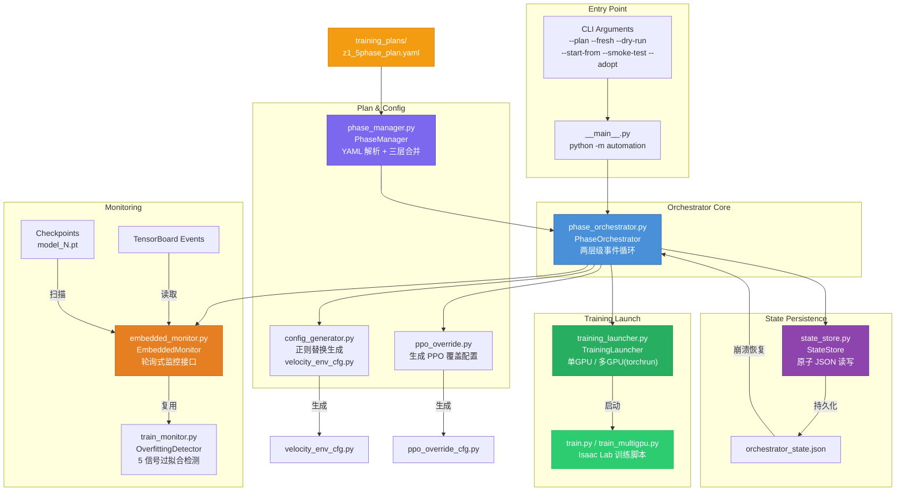
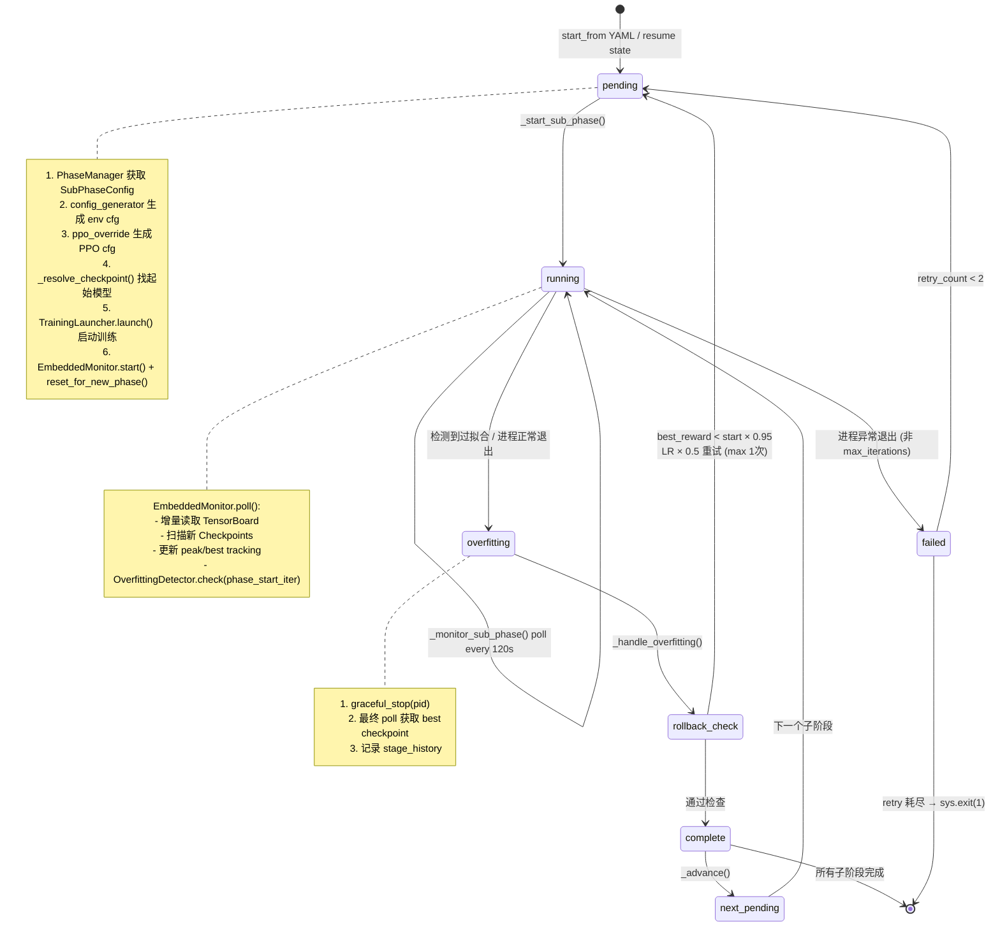
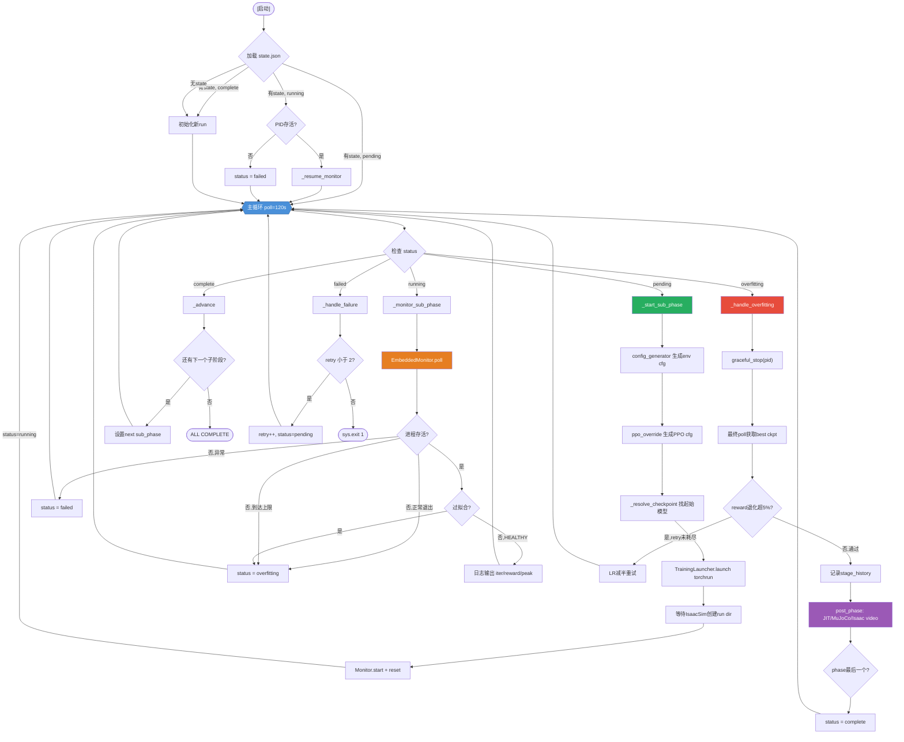
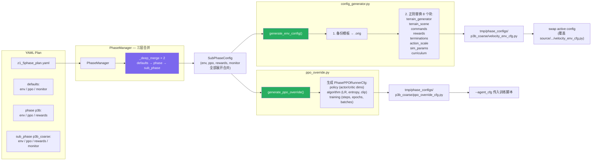
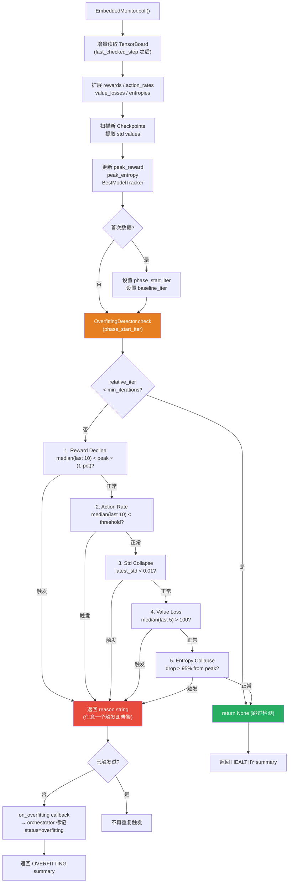
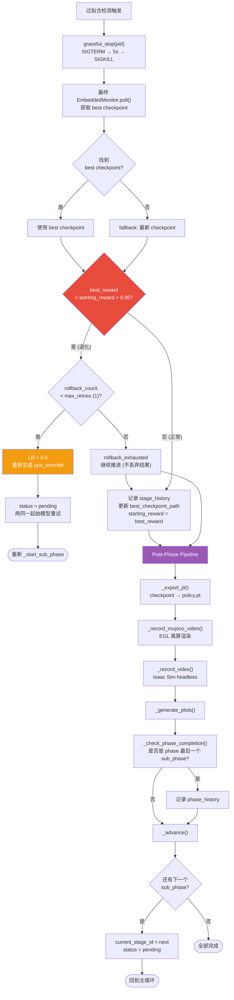
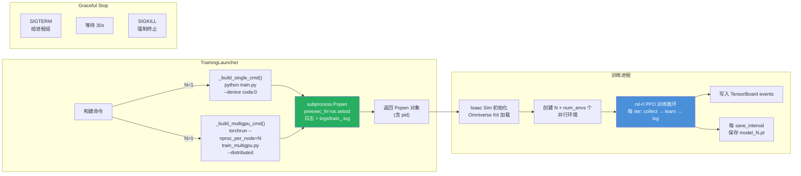
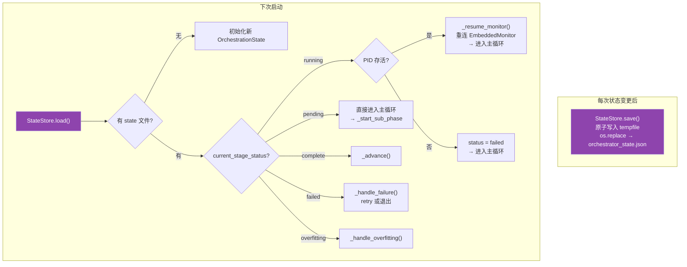
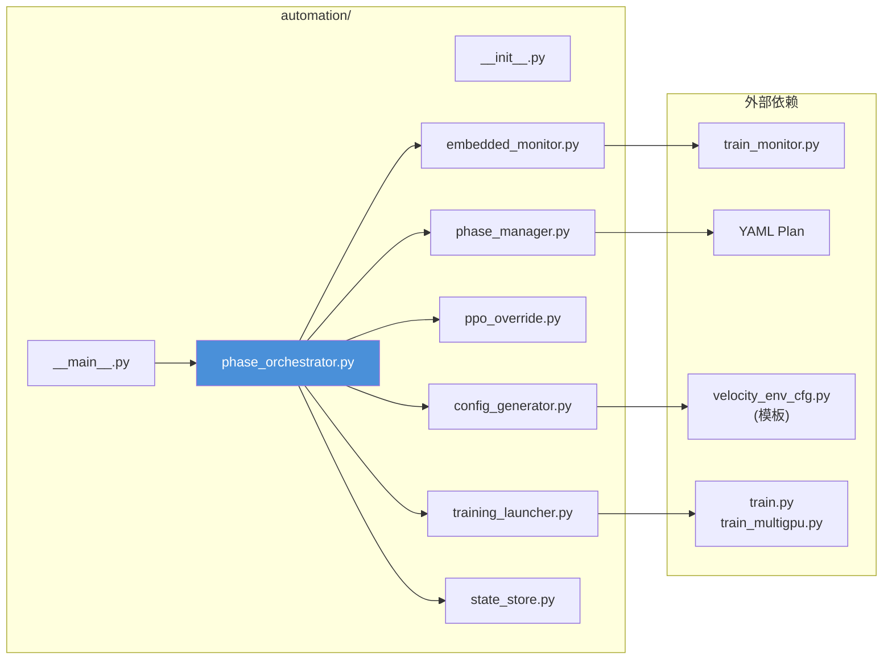

# Automation Framework Architecture

> `scripts/automation/` — 5-Phase Automated RL Training Pipeline

## 1. Module Overview

## 2. Sub-Phase Lifecycle (State Machine)

每个子阶段 (sub-phase) 的完整生命周期：

## 3. Main Event Loop

Orchestrator 主循环的完整流程：

## 4. Config Generation Pipeline

从 YAML 到可训练配置的生成流程：

## 5. Overfitting Detection Pipeline

EmbeddedMonitor 的增量检测流程：

## 6. Rollback & Phase Transition

过拟合处理后的回滚判断与阶段推进：

## 7. Training Launch — Multi-GPU

TrainingLauncher 的多 GPU 训练启动流程：

## 8. Crash Recovery

崩溃恢复机制：

## 9. 5-Phase Curriculum Pipeline

```mermaid
flowchart LR
    subgraph "p1: Flat Bootstrap"
        P1C["p1_coarse<br/>LR=1e-3<br/>no velocity tracking"]
        P1F["p1_fine<br/>LR=5e-4<br/>stand_still penalty"]
        P1C --> P1F
    end

    subgraph "p2: Flat Velocity"
        P2C["p2_coarse<br/>LR=1e-3<br/>vel [-0.3, 0.5]"]
        P2F["p2_fine<br/>LR=5e-4<br/>vel [-0.5, 1.0]"]
        P2C --> P2F
    end

    subgraph "p3: Gentle Terrain"
        P3C["p3_coarse<br/>LR=5e-4<br/>70% flat + 30% random_grid"]
        P3F["p3_fine<br/>LR=3e-4<br/>70% flat + 30% grid 0.5"]
        P3C --> P3F
    end

    subgraph "p3b: Intermediate"
        P3BC["p3b_coarse<br/>LR=1e-4<br/>50% flat + stairs + boxes"]
        P3BF["p3b_fine<br/>LR=8e-5<br/>difficulty 0.4-0.6"]
        P3BC --> P3BF
    end

    subgraph "p4: Rough Terrain"
        P4C["p4_coarse<br/>LR=1e-4<br/>30% flat + stairs/gap/boxes"]
        P4F["p4_fine<br/>LR=8e-5<br/>difficulty 0.5-0.7"]
        P4C --> P4F
    end

    subgraph "p5: Full Terrain"
        P5C["p5_coarse<br/>LR=1e-4<br/>20% each terrain type"]
        P5F["p5_fine<br/>LR=5e-5<br/>final polish"]
        P5C --> P5F
    end

    P1F -->|best ckpt| P2C
    P2F -->|best ckpt| P3C
    P3F -->|best ckpt| P3BC
    P3BF -->|best ckpt| P4C
    P4F -->|best ckpt| P5C
    P5F -->|final model| DONE(["部署"])

    style P3BC fill:#F39C12,color:#fff
    style P3BF fill:#F39C12,color:#fff
```

## 10. File Dependency Map

## Module Summary

| File | LoC | Purpose | Used By |
|------|-----|---------|---------|
| `phase_orchestrator.py` | ~1150 | 两层级事件循环，全流程编排 | `__main__.py` |
| `phase_manager.py` | ~280 | YAML 解析，三层参数合并 | `phase_orchestrator.py` |
| `config_generator.py` | ~400 | 正则替换生成 env config | `phase_orchestrator.py` |
| `ppo_override.py` | ~130 | 生成 PPO 覆盖配置 | `phase_orchestrator.py` |
| `embedded_monitor.py` | ~230 | 增量监控 + 过拟合检测 | `phase_orchestrator.py` |
| `training_launcher.py` | ~180 | 子进程管理 (单/多 GPU) | `phase_orchestrator.py` |
| `state_store.py` | ~120 | 原子 JSON 状态持久化 | `phase_orchestrator.py` |
| `train_monitor.py` | ~700 | 独立监控工具，5 信号检测 | `embedded_monitor.py` |
